# Part 1: Understanding APT & System Updates

## 1. Check APT version first

```bash
apt --version
```


## 2. Update the package list

```bash
sudo apt update
```
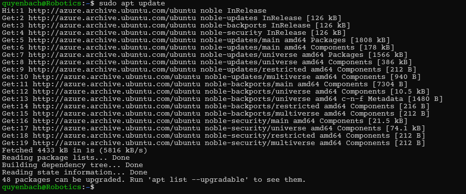

This command is important because it updates the list of the latest packages from repositories, with information about the new version.

## 3. Upgrade installed packages

```bash
sudo apt upgrade -y
```
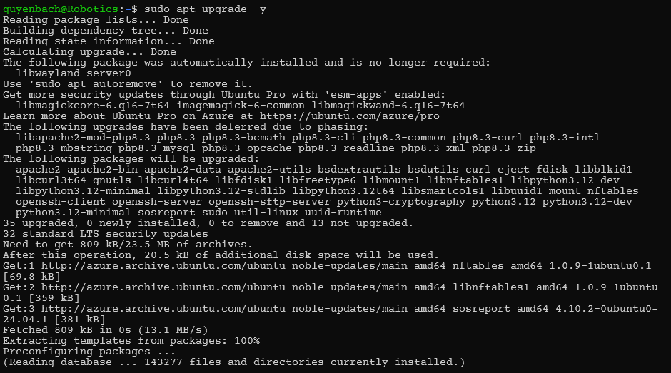

The existing packages will be upgraded to the latest version. With ```-y``` option, it automatically answers "*yes*" to all confirmation questions.

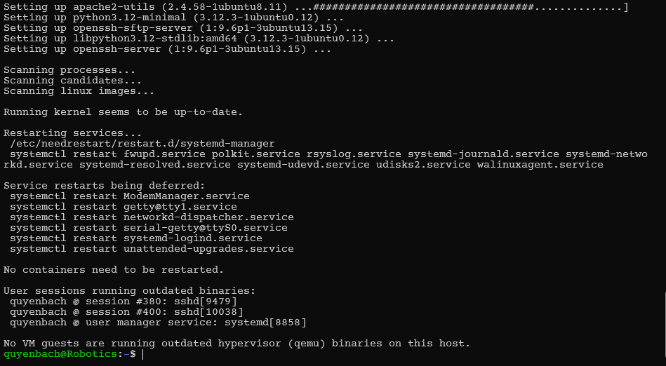

### What is the difference between ```update``` and ```upgrade```?

The ```apt update``` command refreshes the list of available software packages from the software repository so the system knows the latest versions and doesn't install anything. On the other hand, ```apt upgrade``` installs newer versions of packages already installed on the system.

## 4. View pending updates

```bash
apt list --upgradable
```

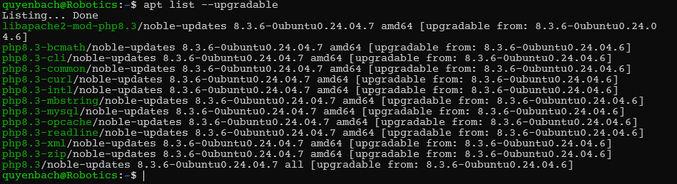

This command displays a list of installed packages that have a newer version without installing anything.

# Part 2: Installing & Managing Packages

## 5. Search for a package using APT

To find ```image editor```, I entered the command:

```bash
apt search image editor
```

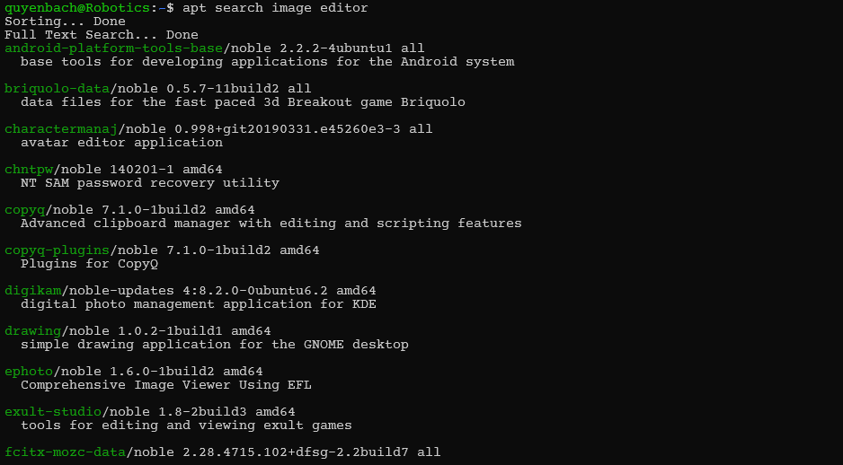

From the suggested list, I chose the ```openshot-qt``` package to install.


## 6. View package details

```bash
apt show openshot-qt
```

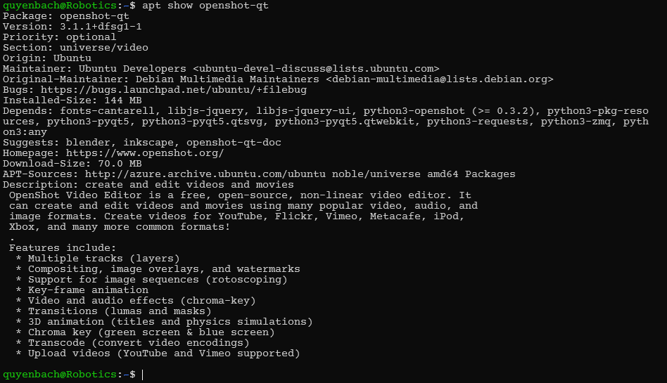

### What dependencies does it require?

The ```openshot-qt``` package requires the following packages to run:
```
fonts-cantarell
libjs-jquery
libjs-jquery-ui
python3-openshot (>= 0.3.2)
python3-pkg-resources
python3-pyqt5
python3-pyqt5.qtsvg
python3-pyqt5.qtwebkit
python3-requests
python3-zmq
python3:any
```
These packages provide the necessary components for the video editor to function.

## 7. Install the package

Next, I executed the following command to install the package.

```bash
sudo apt install openshot-qt -y
```

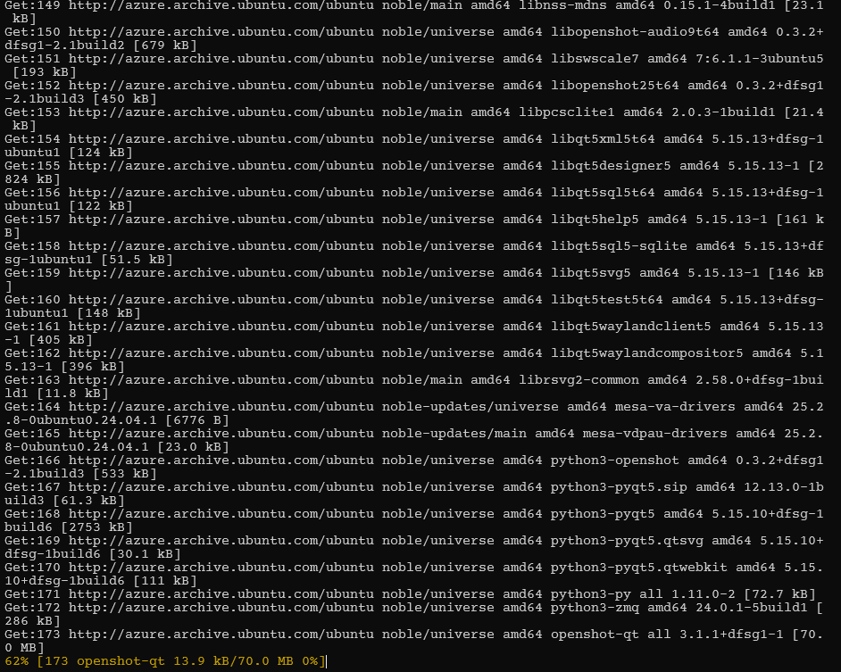

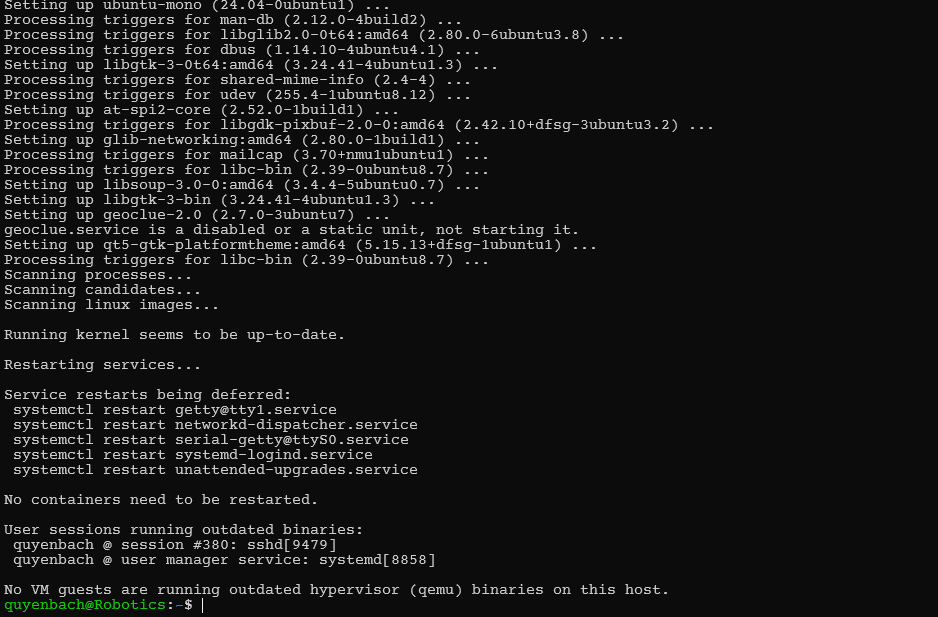

## 8. Check installed package version

I made sure that the package was installed.

```bash
apt list --installed | grep openshot-qt
```

The software package was successfully installed.

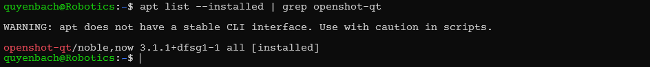

### What version was installed?

Using the command below:

```bash
openshot-qt --version
```
The ```openshot-qt``` package I installed is version 3.1.1


# Part 3: Removing & Cleaning Packages

## 9. Uninstall the package

To uninstall the ```openshot-qt``` software package, I typed the following command.

```bash
sudo apt remove openshot-qt -y
```


### Is the package fully removed?

No, it was not completely removed. The system only removed the main ```openshot-qt``` package but retained its configuration files on the system.

To delete the configuration files as well, I typed the following:

## 10. Remove configuration files as well

```bash
sudo apt purge openshot-qt -y
```

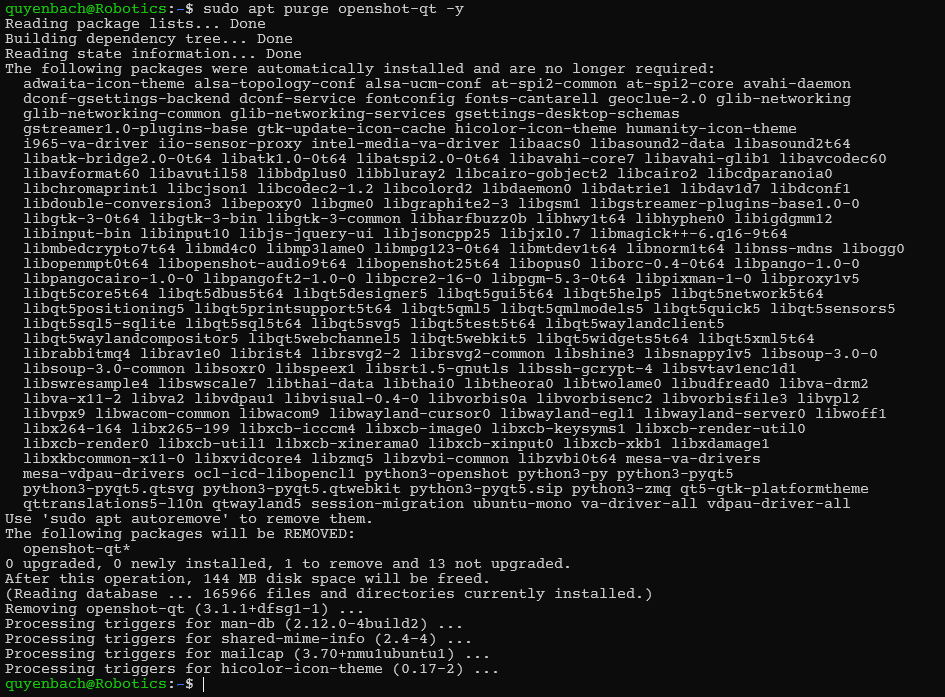

### What is the difference between ```remove``` and ```purge```?

Although both uninstall a software package, they handle configuration files differently. The ```apt remove``` command uninstalls the program but leaves the configuration files on the system. The ```apt purge``` command removes the program and deletes its configuration files, completely cleaning the program from the system.

## 11. Clear unnecessary package dependencies

I also needed to remove unnecessary package dependencies by typing the command.

```bash
sudo apt autoremove -y
```

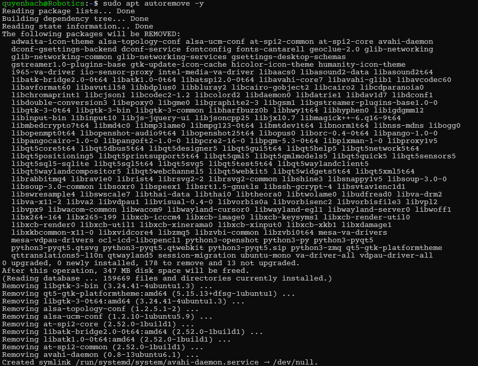

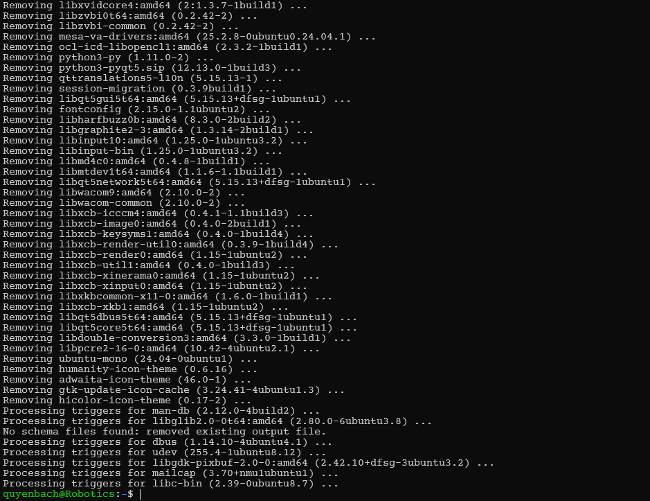

### Why is this step important?

Yes, the ```sudo apt autoremove -y``` command can be important in the long run, as it is used for system cleanup. This command removes no longer needed packages.

## 12. Clean up downloaded package files

I used a command to delete downloaded package files.

```bash
sudo apt clean
```


### What does this command do?

When installing the package, the downloaded file remained after the installation was complete. Therefore, this command is needed to remove these package files.

# Part 4: Managing Repositories & Troubleshooting

## 13. List all APT repositories

To view all APT repositories, I typed the following command to list them.

```bash
cat /etc/apt/sources.list
```

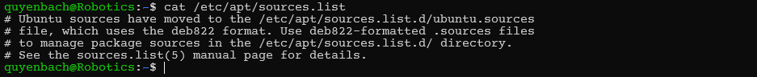

### What do I notice in this file?

This file means that on modern versions of Ubuntu, ```/etc/apt/sources.list``` is no longer used. Instead, package repositories are now defined in ```/etc/apt/sources.list.d/ubuntu.sources```.

```bash
cat /etc/apt/sources.list.d/ubuntu.sources
```

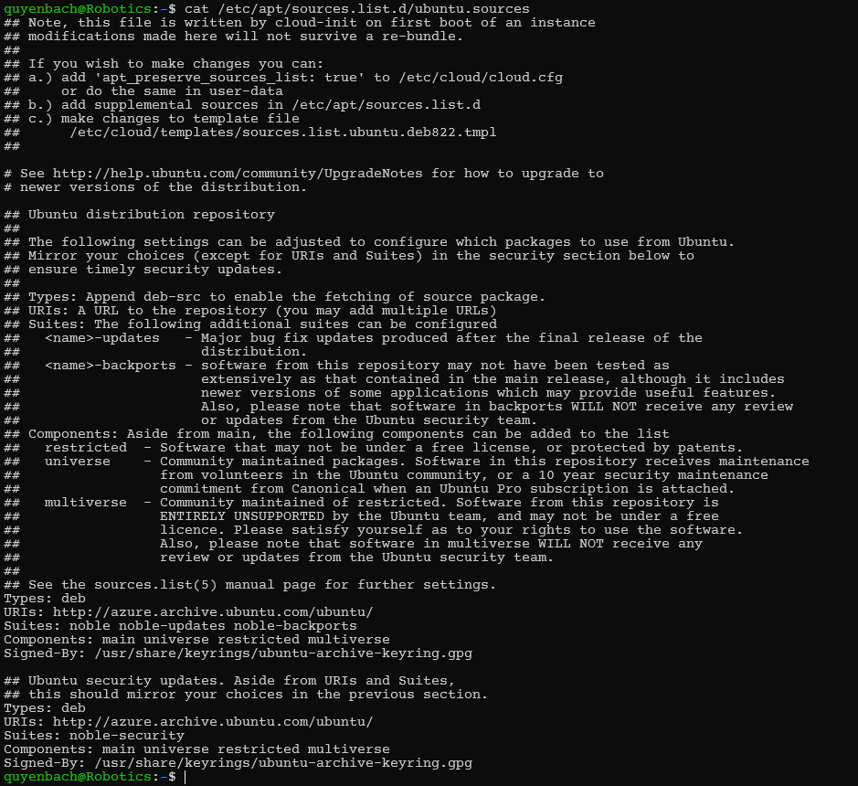

## 14. Add a new repository

I used the commands to add a new repository.

```bash
sudo add-apt-repository universe
sudo apt update
```


### What types of packages are found in the universe repository?

This type of packages is not officially from the Ubuntu developers, but is supported by the Ubuntu community.

## 15. Simulate an installation failure and troubleshoot

I tried installing a software package that doesn't exist.

```bash
sudo apt install fakepackage
```


### What error message do you get?

The error message you received is ```E: Unable to locate package fakepackage```. This means that APT could not find the package named ```fakepackage``` in any repositories.

### How would you troubleshoot this issue?

First, I would check the package name to make sure it is correct. Then I execute ```sudo apt update``` to get a list of the latest packages. If I still cannot find the package, I would use ```apt search``` with the package name to determine if the name might be incorrect. Finally, I would check for any missing repositories.

# Bonus Challenge

## Use apt-mark to hold and unhold a package so it doesn't get updated

```bash
sudo apt-mark hold python3
sudo apt-mark unhold python3
```


### Why would I want to hold a package?

Sometimes updates can cause bugs or break compatibility with other packages. Therefore, it is necessary to retain the current stable package. Additionally, if I have a project that requires a specific version of a package, I would want to hold the package.

